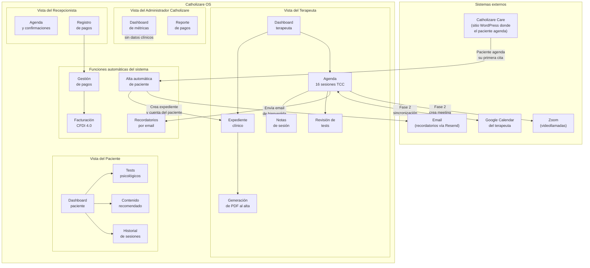
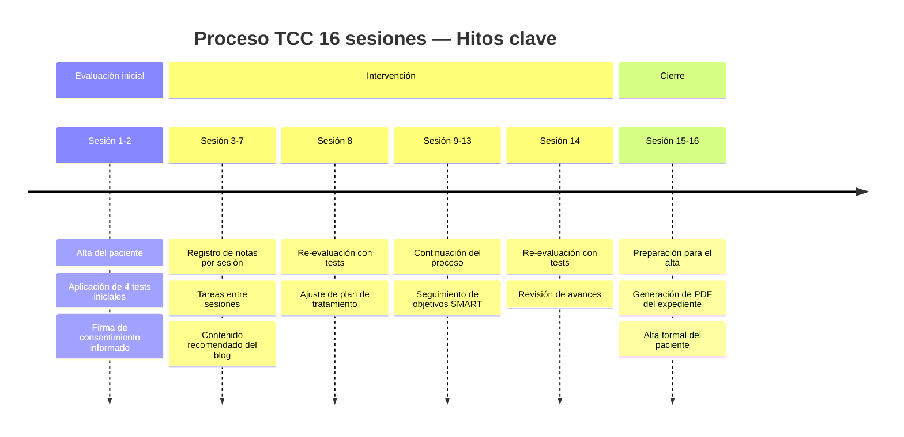
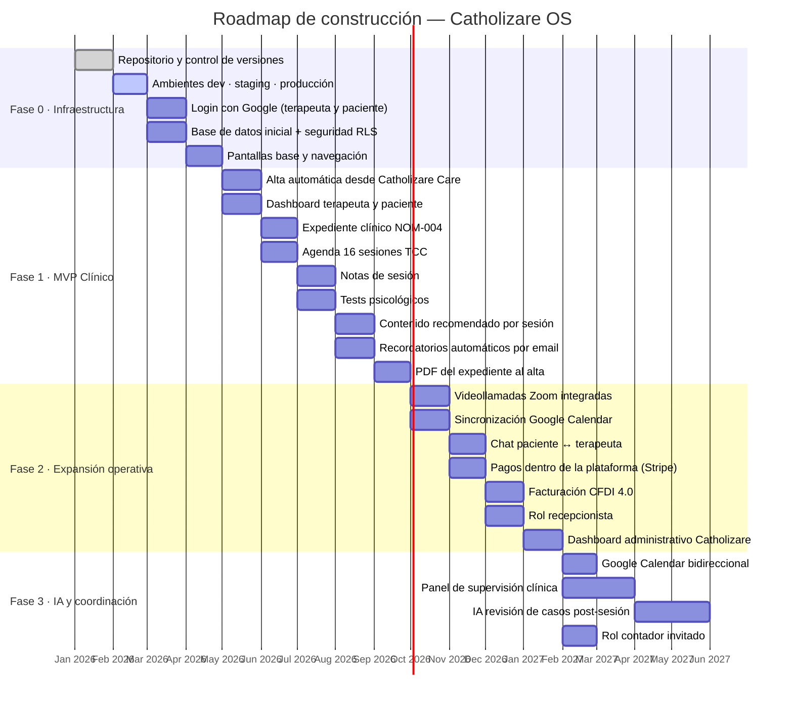
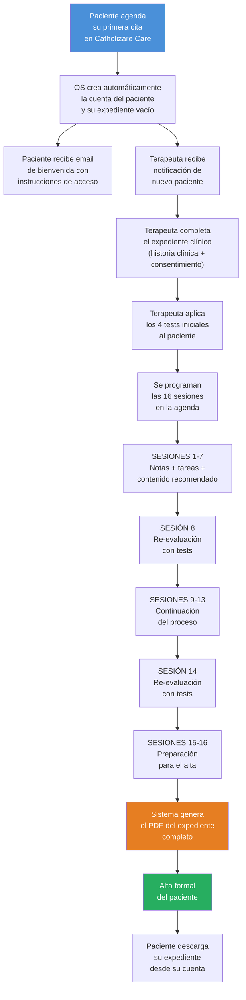

# Catholizare OS — Descripción funcional del producto

**Versión para revisión de directores**
Fecha: abril 2026

---

## ¿Qué es Catholizare OS?

Catholizare OS es la **plataforma digital de gestión clínica** de Catholizare. Es el sistema donde viven los terapeutas y sus pacientes una vez que el paciente agenda su primera cita en el sitio web de Catholizare Care.

**El problema que resuelve:**
Hoy un terapeuta de Catholizare lleva su expediente clínico en papel o en hojas de Excel, agenda por WhatsApp, y no tiene forma de hacer seguimiento estructurado del proceso terapéutico. Cuando el paciente llega al alta, no hay historial centralizado, no hay PDF con cumplimiento legal, no hay métricas de operación.

**Lo que Catholizare OS entrega:**
Un sistema unificado donde el terapeuta gestiona todo su proceso clínico desde un solo lugar, el paciente tiene visibilidad de su propio proceso, y el equipo administrativo de Catholizare puede ver métricas de operación sin tocar datos sensibles de los pacientes.

---

## ¿Quiénes usan el sistema?

El sistema tiene **4 tipos de usuario**, cada uno con una vista y permisos distintos:

| Usuario | Quién es | Qué hace en el sistema |
|---|---|---|
| **Terapeuta** | El profesional de salud mental | Gestiona su agenda, expedientes, notas de sesión y evaluaciones |
| **Paciente** | La persona en proceso terapéutico | Ve su progreso, completa evaluaciones, recibe recordatorios y contenido |
| **Recepcionista** | Apoyo administrativo del terapeuta | Gestiona agenda y pagos; sin acceso al expediente clínico |
| **Administrador Catholizare** | El equipo directivo de Catholizare | Ve métricas agregadas de operación; sin acceso a datos clínicos individuales |

---

## Diagrama general del sistema

---

## Módulos del sistema por usuario

---

### TERAPEUTA — Lo que gestiona el profesional

#### Módulo 1: Dashboard del terapeuta
La primera pantalla que ve el terapeuta al entrar al sistema. Es su centro de control.

**Funciones:**
- Ver el listado de sus pacientes activos, en alta y suspendidos
- Ver las sesiones programadas para hoy y para la semana
- Recibir alertas de pacientes con riesgo detectado (scores altos en tests de ansiedad o depresión, faltas consecutivas)
- Acceso rápido al expediente de cualquier paciente con un clic
- Notificaciones del sistema (recordatorios pendientes, pagos vencidos en Fase 2)

---

#### Módulo 2: Expediente clínico
El corazón del sistema. Cumple con la **NOM-004-SSA3-2012** (norma oficial de expediente clínico en México) y la **NOM-024** (expediente clínico electrónico).

**Funciones:**
- Crear y editar la historia clínica completa del paciente:
  - Datos de identificación
  - Motivo de consulta
  - Antecedentes personales y familiares
  - Diagnóstico
  - Plan de tratamiento
- Registrar el consentimiento informado electrónico del paciente (con firma de aceptación y fecha)
- Ver el historial de cambios del expediente (quién modificó qué y cuándo)
- Generar el PDF del expediente completo al momento del alta (ver Módulo 6)

**Importante:** Cada acceso al expediente queda registrado automáticamente en una bitácora de auditoría, como exige la norma.

---

#### Módulo 3: Agenda de 16 sesiones TCC
La agenda no es un calendario genérico. Está diseñada específicamente para el **proceso de Terapia Cognitivo-Conductual (TCC) de 16 sesiones** que Catholizare aplica.

**Funciones:**
- Ver el proceso completo de cada paciente: qué sesión va, cuántas quedan, cuándo son las re-evaluaciones
- Programar, reagendar y cancelar sesiones con registro del motivo
- Ver el estado de cada sesión: pendiente, realizada, cancelada, falta del paciente
- Recibir alerta cuando un paciente tiene faltas consecutivas que ponen en riesgo el proceso
- (Fase 2) Generar automáticamente el link de Zoom para cada sesión
- (Fase 2) Sincronizar con Google Calendar del terapeuta

**Estructura del proceso TCC de 16 sesiones:**

---

#### Módulo 4: Notas de sesión
Registro estructurado de lo que ocurre en cada sesión.

**Funciones:**
- Registrar la nota de sesión con campos estructurados:
  - Agenda planificada de la sesión vs lo que realmente se trabajó
  - Observaciones clínicas del terapeuta
  - Técnicas TCC aplicadas
  - Tareas asignadas al paciente para la siguiente sesión
- Registrar y actualizar la **conceptualización del caso**: el modelo cognitivo del paciente que evoluciona durante el tratamiento
- Registrar el **plan de tratamiento** con objetivos SMART y técnicas por sesión
- Separar claramente las notas privadas del terapeuta (que el paciente no ve) de las notas compartidas

---

#### Módulo 5: Tests psicológicos
Aplicación y seguimiento de evaluaciones estandarizadas.

**Funciones (terapeuta):**
- Ver los resultados de los tests aplicados al paciente
- Ver la evolución del paciente entre la evaluación inicial, la sesión 8 y la sesión 14
- Recibir alertas automáticas cuando un score supera el umbral de riesgo
- Comparar resultados entre evaluaciones para medir progreso

**Los 4 tests iniciales y sus re-evaluaciones se definen con el equipo clínico de Catholizare** antes de su implementación.

---

#### Módulo 6: Generación de PDF al alta
Cuando el paciente completa el proceso, el sistema genera automáticamente el documento oficial de cierre.

**Funciones:**
- Generar el PDF del expediente clínico completo con:
  - Historia clínica
  - Consentimiento informado firmado
  - Registro de las 16 sesiones
  - Notas de sesión
  - Resultados de todos los tests
  - Plan de tratamiento ejecutado
  - Nota de alta
- El PDF se almacena de forma segura y está disponible por 5 años mínimo (exigencia de NOM-024)
- El paciente puede descargarlo desde su cuenta
- El terapeuta y el equipo Catholizare lo conservan en el expediente

---

### PACIENTE — Lo que ve y hace el paciente

#### Módulo 7: Dashboard del paciente
La pantalla principal del paciente. Simple, sin terminología clínica compleja.

**Funciones:**
- Ver su próxima sesión (fecha, hora, terapeuta asignado)
- (Fase 2) Ver el link de Zoom para entrar a la sesión
- Ver las tareas que su terapeuta le asignó para antes de la próxima sesión
- Ver los 3 artículos del blog de Catholizare que su terapeuta seleccionó para esta etapa de su proceso
- Ver su historial de sesiones pasadas (resumen general, sin las notas privadas del terapeuta)
- Descargar su PDF de expediente cuando llegue al alta

---

#### Módulo 8: Tests psicológicos (vista paciente)
El paciente responde sus evaluaciones directamente en la plataforma.

**Funciones:**
- Ver las evaluaciones pendientes asignadas por su terapeuta
- Responder los tests desde cualquier dispositivo (computadora, celular)
- Ver un resumen de sus resultados tras completar cada test
- Los resultados se envían automáticamente al terapeuta

---

#### Módulo 9: Contenido recomendado
Artículos del blog de Catholizare seleccionados para el paciente según su etapa del proceso.

**Funciones:**
- Recibir 3 artículos recomendados por sesión, elegidos por el terapeuta según el tema trabajado
- Acceder al contenido directamente desde el dashboard, sin salir a buscar en el sitio web
- El contenido se actualiza tras cada sesión

---

### RECEPCIONISTA — Apoyo administrativo (Fase 2)

#### Módulo 10: Gestión de agenda y pagos
El recepcionista ayuda con la operación administrativa sin tener acceso a información clínica.

**Funciones:**
- Ver y gestionar la agenda de los terapeutas (confirmar citas, registrar cancelaciones)
- Registrar pagos de sesiones y membresías
- Ver el estado de pago de cada paciente (al corriente, con adeudo, suspendido)
- **No puede ver** el expediente clínico, las notas de sesión, los tests ni nada relacionado con el contenido de la terapia

---

### ADMINISTRADOR CATHOLIZARE — Vista directiva (Fase 2)

#### Módulo 11: Dashboard administrativo
Métricas de operación de la plataforma para el equipo directivo de Catholizare.

**Funciones:**
- Ver métricas agregadas de la operación:
  - Número de pacientes activos en la plataforma
  - Tasas de alta completada vs abandono
  - Ingresos por período (membresías, paquetes de sesiones)
  - Número de sesiones realizadas por período
  - Alertas de operación (caída de ingresos, incremento de cancelaciones)
- Exportar reportes a Excel o PDF
- **No puede ver** datos individuales de pacientes ni contenido de expedientes

---

## Funciones automáticas del sistema

Estas funciones ocurren en segundo plano, sin que ningún usuario tenga que activarlas manualmente:

### Alta automática de paciente
Cuando el paciente agenda su primera cita en **Catholizare Care** (el sitio WordPress), el sistema recibe esa información automáticamente y:
1. Crea la cuenta del paciente en Catholizare OS
2. Crea su expediente clínico vacío, listo para que el terapeuta lo complete
3. Envía un email de bienvenida al paciente con sus instrucciones de primer acceso
4. Notifica al terapeuta asignado

El terapeuta no tiene que dar de alta al paciente manualmente.

### Recordatorios automáticos por email
El sistema envía emails automáticos en los siguientes momentos:
- **24 horas antes de la sesión:** al paciente y al terapeuta
- **1 hora antes de la sesión:** al paciente
- **Después de la sesión:** recordatorio de tareas asignadas al paciente
- **Cuando se acerca una re-evaluación:** aviso a terapeuta y paciente (sesiones 8 y 14)

### Bitácora de auditoría
Cada vez que alguien accede, crea o modifica un expediente clínico, el sistema registra automáticamente:
- Quién accedió
- Qué hizo exactamente
- Desde dónde y cuándo

Este registro no se puede borrar y cumple con los requisitos de trazabilidad de la NOM-004.

---

## Roadmap por fases

El producto se construye en 4 fases. Las fases 0 y 1 son el MVP que estamos construyendo ahora.

---

## Resumen de funciones por fase

### Fase 0 — Infraestructura (en curso)
Lo que se construye: los cimientos técnicos del sistema. El usuario no ve funciones nuevas todavía, pero sin esto nada lo demás funciona.

| Qué se construye | Para qué sirve |
|---|---|
| Control de versiones y flujos de trabajo en GitHub | Gestión del equipo de desarrollo |
| 3 ambientes separados (desarrollo, pruebas, producción) | Probar cambios sin afectar pacientes reales |
| Login con Google para terapeutas y pacientes | Acceso seguro sin contraseñas |
| Base de datos con aislamiento por terapeuta | Que los datos de un terapeuta nunca se mezclen con los de otro |
| Pantallas base, navegación y menús | La estructura visual del sistema |

---

### Fase 1 — MVP clínico (siguiente)
El producto mínimo que puede ser usado con pacientes reales de Catholizare. Cubre el proceso completo de principio a fin.

| Módulo | Funciones principales |
|---|---|
| Alta automática | El paciente que agenda en Care aparece solo en OS, sin trabajo manual |
| Dashboard terapeuta | Lista de pacientes, próximas sesiones, alertas |
| Dashboard paciente | Próxima sesión, tareas, contenido, historial |
| Expediente clínico | Historia clínica completa, consentimiento, cumplimiento NOM-004 |
| Agenda 16 sesiones | Proceso TCC estructurado, reagendas, re-evaluaciones en sesión 8 y 14 |
| Notas de sesión | Registro estructurado + conceptualización del caso + plan de tratamiento |
| Tests psicológicos | 4 tests iniciales + re-evaluaciones, scoring automático, alertas de riesgo |
| Contenido recomendado | 3 artículos del blog de Care por sesión, visibles en el dashboard del paciente |
| Recordatorios por email | Automáticos 24h y 1h antes de sesión, post-sesión y pre-evaluación |
| PDF del expediente | Generado al alta, cumple NOM-024, almacenado 5 años |

---

### Fase 2 — Expansión operativa
Convierte el MVP en una plataforma operativa completa con pagos, comunicación y administración.

| Módulo | Funciones principales |
|---|---|
| Videollamadas Zoom | Link generado automáticamente al programar cada sesión |
| Google Calendar | Las sesiones de OS aparecen en el calendario del terapeuta |
| Chat interno | Comunicación asíncrona paciente ↔ terapeuta dentro de OS |
| Pagos en plataforma | Membresías y paquetes de sesiones sin salir a otro sistema |
| Facturación CFDI 4.0 | Factura automática tras cada pago, descargable por el paciente |
| Recepcionista | Gestión de agenda y pagos sin acceso a expedientes clínicos |
| Dashboard directivo | Métricas de operación para el equipo Catholizare, sin datos clínicos |

---

### Fase 3 — IA y coordinación clínica
Agrega inteligencia artificial y estructuras de supervisión para escalar la operación.

| Módulo | Funciones principales |
|---|---|
| Google Calendar bidireccional | Cambios en Google Calendar se reflejan en OS y viceversa |
| Panel de supervisión | Terapeutas senior revisan casos de terapeutas junior con permisos graduados |
| IA revisión de casos | Sugerencias automáticas post-sesión (el terapeuta siempre aprueba) |
| Rol contador | Acceso de solo lectura a datos fiscales, sin ver expedientes |

---

## Flujo completo del paciente — de Care a OS hasta el alta

---

## Preguntas frecuentes para los directores

**¿Los datos de los pacientes están seguros?**
Sí. Cada terapeuta solo puede ver los datos de sus propios pacientes. Ningún terapeuta puede ver los expedientes de otro. El equipo administrativo de Catholizare ve métricas de operación, pero nunca el contenido de los expedientes.

**¿El sistema cumple con la ley mexicana?**
Sí. El diseño del expediente clínico sigue la NOM-004-SSA3-2012 y la NOM-024-SSA3-2012. Toda acción clínica queda registrada en una bitácora. Los datos se almacenan por 5 años mínimo como exige la norma.

**¿Qué pasa si el terapeuta ya usa Google Calendar?**
En Fase 2, las sesiones de Catholizare OS se sincronizan automáticamente con el Google Calendar del terapeuta. El terapeuta no tiene que registrar la cita dos veces.

**¿El paciente puede usar la plataforma desde el celular?**
Sí. La plataforma funciona en cualquier navegador web, incluyendo el celular, sin necesidad de descargar ninguna app.

**¿Cuándo estará listo para usarse con pacientes reales?**
Al cerrar la Fase 1. Todo lo de Fase 0 son cimientos técnicos que el usuario no ve. La Fase 1 entrega el producto completo de principio a fin: desde que el paciente llega hasta que se genera su PDF de alta.

**¿Qué pasa si el terapeuta quiere facturar sus sesiones?**
La facturación electrónica (CFDI 4.0) está incluida en la Fase 2. Cuando el paciente paga dentro de la plataforma, el sistema genera la factura automáticamente.

---

*Este documento describe el alcance funcional acordado al 28 de abril de 2026. Cualquier ajuste a este alcance debe aprobarse en sesión con el Product Owner antes de modificar el roadmap de desarrollo.*
